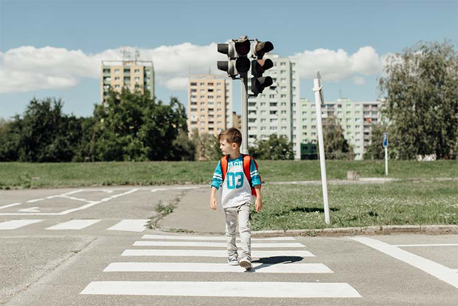
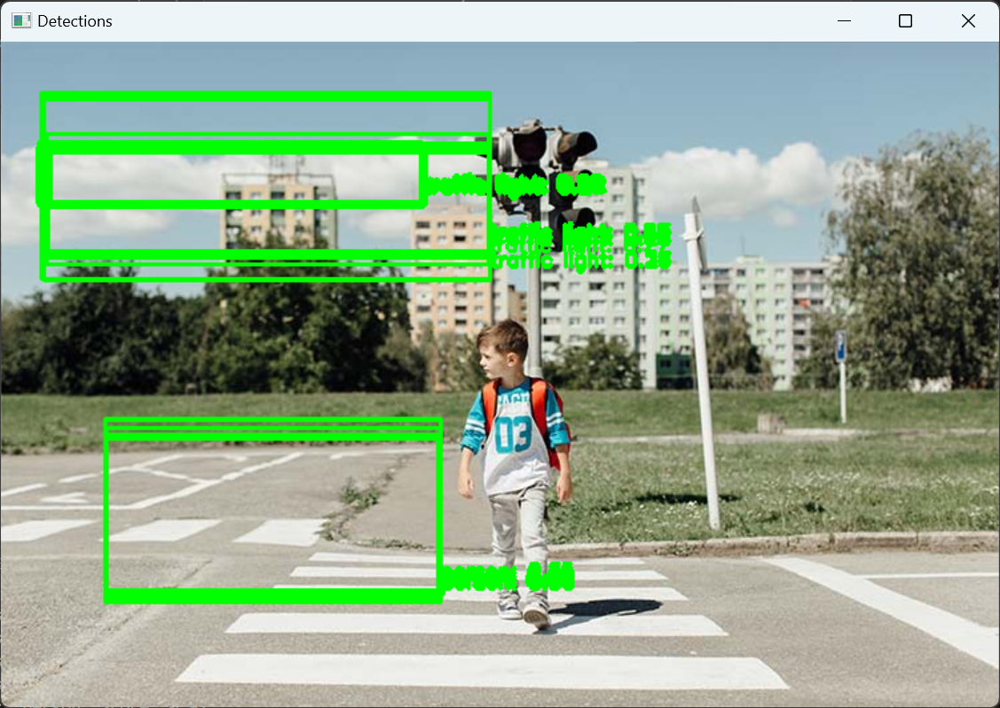
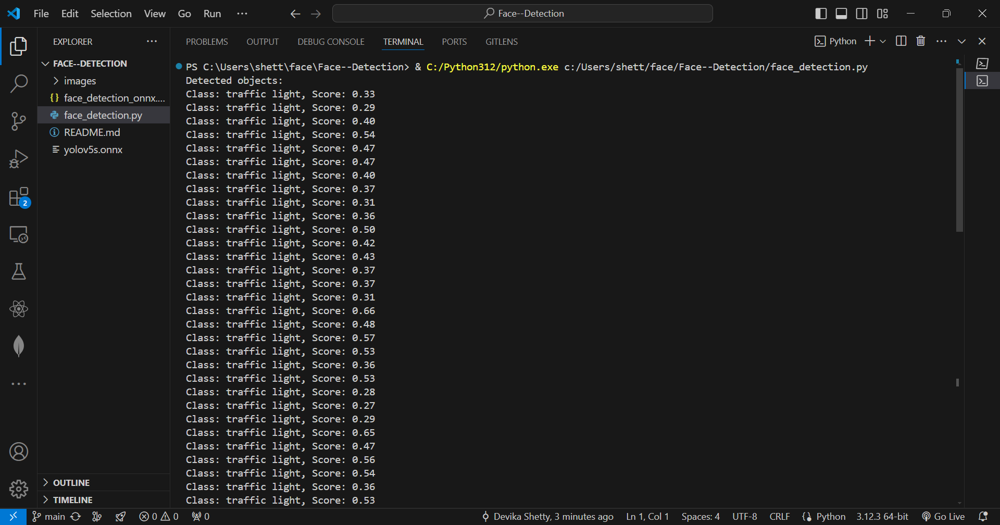
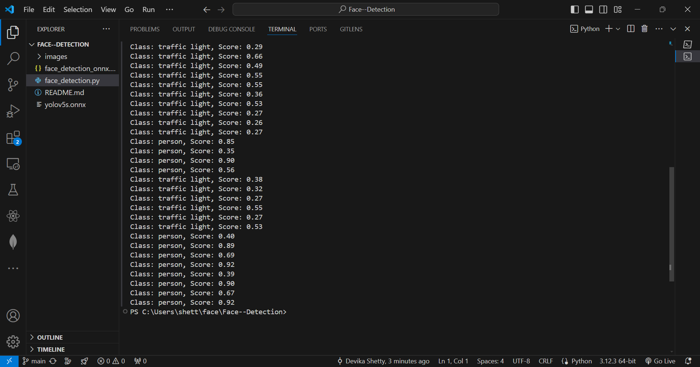

# Face Detection with YOLOv5 and ONNX

## Table of Contents

- [Project Description](#project-description)
- [Technologies Used](#technologies-used)
- [Installation](#installation)
- [Usage](#usage)
- [Results](#results)
- [Screenshots](#screenshots)
- [Conclusion](#conclusion)
- [Acknowledgements](#acknowledgements)

## Project Description

This project demonstrates the implementation of a face detection system using the YOLOv5 model converted to ONNX format. The system processes input images to accurately detect and localize faces, drawing bounding boxes around detected faces and providing confidence scores.

## Technologies Used

- **Programming Language**: Python
- **Machine Learning**: TensorFlow, Keras, scikit-learn
- **Natural Language Processing**: NLTK, SpaCy
- **Data Handling**: Pandas
- **Development Environment**: Visual Studio Code


## Installation

1. **Clone the Repository**:

   ```sh
   git clone https://github.com/shettydevika/Face--Detection.git
   cd face-detection-onnx

2. **Create and Activate a Virtual Environment**:

   ```sh
   python -m venv venv
   source venv/bin/activate  # On Windows, use `venv\Scripts\activate`

3. Install Dependencies:

   ```sh
   pip install -r requirements.txt

## Usage

1. **Prepare the Input Image**:

  - **Place the image you want to test in the images directory**.
  - **Ensure the image path in your script is correctly set to the location where the image is saved. For example**:
     ```sh
       image_path = 'images/image1.jpg'

2. **Run the Face Detection Script**:
   ```sh
    python face_detection.py

3. **View Results**:

The script will display the input image with detected faces marked by bounding boxes and labeled with confidence scores.

## Results

The YOLOv5 ONNX model successfully detects faces in input images with high accuracy and efficiency. Detected faces are marked with bounding boxes, and confidence scores are displayed, indicating the reliability of the detections.

## Screenshots


- **Figure 1: Test Image**


- **Figure 2: Face Detection Result**


- **Figure 3: VS Code Result**



## Conclusion

The face detection project using the YOLOv5 ONNX model showcases the model's effectiveness in identifying and localizing faces in real-time. This project highlights the practical application of advanced neural network models in various domains, providing valuable hands-on experience and fostering a deeper understanding of AI technologies.

## Acknowledgements

Thanks to the open-source community for providing the tools and libraries that made this project possible.
